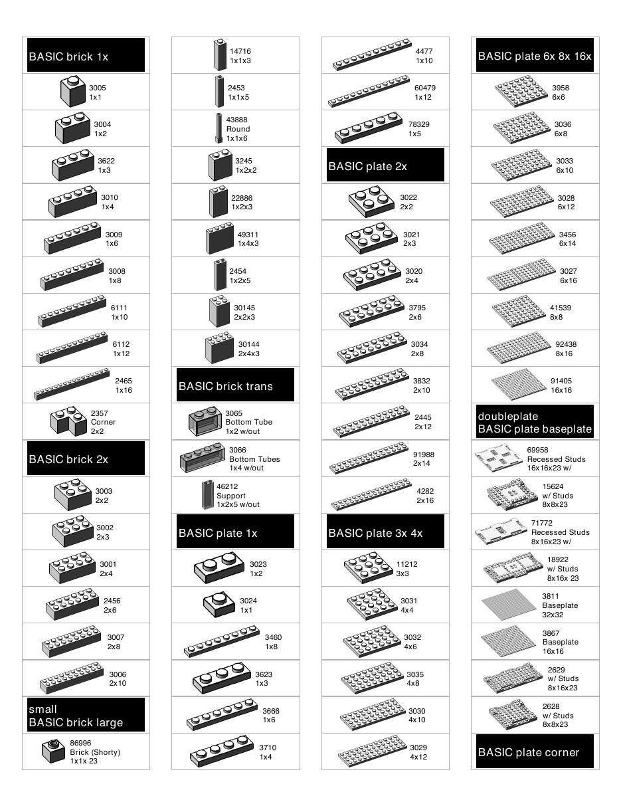

# brickarchitect-label-converter

Convert Brother P-touch LBX label sets into Avery 5167 label sheets as PDFs. This is for batch printing LEGO storage labels without wasting partial sticker sheets.

<!-- screenshots:begin (managed by screenshot-docs) -->

<!-- screenshots:end -->

## Quick start
```bash
python3 lbx_to_avery_5167.py LEGO_BRICK_LABELS-v40/Labels \
  --output output/avery_5167.pdf \
  --draw-outlines
```

Add `--calibration` to prepend a calibration page. Add `--include-partial` to also emit a partial final page instead of only full 80-label pages. See [docs/USAGE.md](docs/USAGE.md) for the full flag list.

## Documentation

Getting started:
- [docs/INSTALL.md](docs/INSTALL.md): Setup requirements and dependencies.
- [docs/USAGE.md](docs/USAGE.md): CLI usage, flags, and examples.

Understanding the tool:
- [docs/CODE_ARCHITECTURE.md](docs/CODE_ARCHITECTURE.md): High-level design and data flow.
- [docs/FILE_STRUCTURE.md](docs/FILE_STRUCTURE.md): Directory map and what belongs where.
- [docs/LABEL_BOUNDARIES.md](docs/LABEL_BOUNDARIES.md): How label boundaries are detected.

Reference:
- [docs/TROUBLESHOOTING.md](docs/TROUBLESHOOTING.md): Known issues and fixes.
- [docs/CHANGELOG.md](docs/CHANGELOG.md): Timeline of changes.

## Testing
```bash
pytest tests/
```
